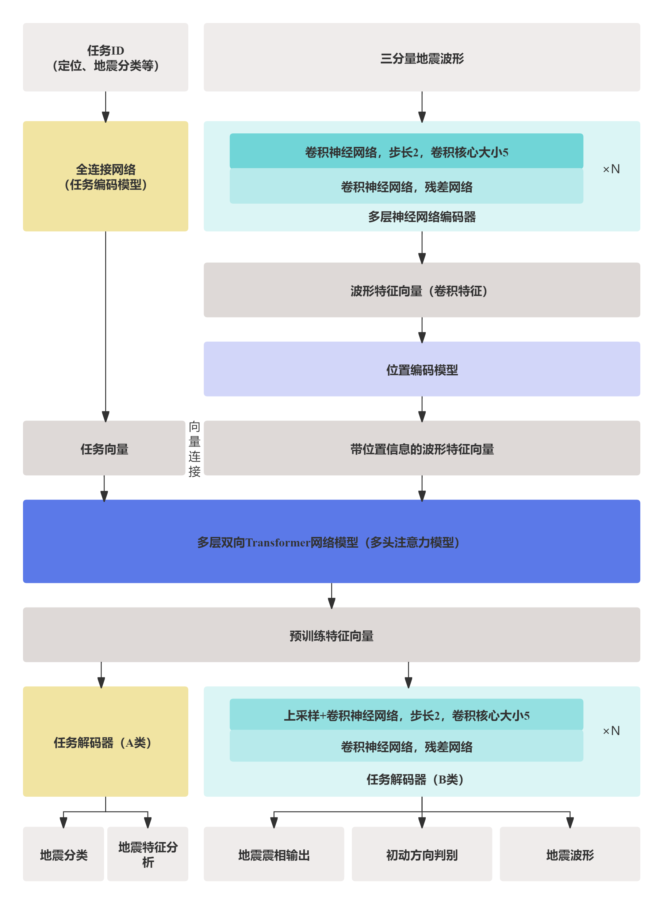

### PRIME地震数据处理模型
我们的模型主要是基于Transformer的，使用Transformer来处理波形的特征。


当前有几个模型
|模型名称|可训练参数数量|模型地址|状态|
|:-:|:-:|:-:|:-:|
|RNN版模型|77M|ckpt/primedp.rnn.pt|发布|
|Picker模型|0.5M|ckpt/primedp.picker.pt|发布|
|小模型|8.6M|ckpt/primedp.tinny.pt|发布|
|中模型|51M|ckpt/primedp.middle.pt|发布|
|大模型|1.3B|ckpt/primedp.large.pt|训练中|

### 1. 使用方式
```Python 
from prime.middle import PRIMEDP 
import torch 

model = PRIMEDP() 
#加载预训练模型
model.load_state_dict(torch.load("ckpt/primedp.middle.pt"))
#输入波形
x = torch.randn([32, 3, 10240])# N, C, T顺序
# 震相, 初动, 地震类型, 波形, 波形特征向量
phase, polar, event_type, wave, hidden = model(x) 
# 可以用于其他处理
# TO:比如使用hidden用于聚类分析
```

### 2. 迁移学习
以分类工作为例：
```Python 
# 定义可训练部分
for key, var in model.named_parameters():
    if var.dtype != torch.float32:continue # BN统计计数无梯度
    if "decoder_event_type" in key: # 仅有最后一层有out
        var.requires_grad = True
    else:
        var.requires_grad = False  
# 定义训练器    
optim = torch.optim.Adam(filter(lambda p: p.requires_grad, model.parameters()), 1e-3, weight_decay=1e-1)
```
"ckpt\primedp.middel.classification.pt"用内蒙数据迁移训练的。

也可以使用特征来进行分类：
```Python 
import torch.nn as nn 

class Classification(nn.Module):
    def __init__(self) -> None:
        super().__init__() 
        self.decoder = nn.Linear(1024, 3) 
    def forward(self, x):
        y = self.decoder(x) 
        return y 
model = PRIMEDP() 
model.load_state_dict(torch.load("ckpt/primedp.middle.pt"))
x = torch.randn([32, 3, 10240])# N, C, T format. 
phase, polar, event_type, wave, hidden = model(x) 

decoder = Classification() 
vector = hidden[:, :, 0]#选择第0个输出，也可以使用其他输出
vector = vector.detach() 
y = decoder(vector) 
# TODO:定义损失函数并对decoder进行训练即可。
```

### 3. 联系方式
caiyuqiming@foxmail.com